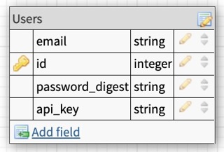

<center><h1>Info</h1></center>
This is the final project for the 2203 BE module 3. This repo holds endpoits that are made available by running rails s and looking for the responnses within postman. User endpoints are below, and display data for a front end program that would make calls to these endpoints on the back end of this application. The API's used are listed below as well.


# Built With 
   
   

# Gems 
   
   
   
   
   
   
   

# Set Up
- Clone this repo
- `bundle install`
- `rails s`

# Database Creation
- `rails db:{create,migrate}``

# Database Structure



# Testing Instructions

 - Clone this repo
 - in terminal (apple or integrated)    
    * bundle install
    * bundle exec rspec 

# API's
 [Open Weather](https://openweathermap.org/api)

 [MapQuest](https://developer.mapquest.com/)

# End Points

## Road Trip 

```
get http://localhost:3000/api/v1/road_trip?origin="Denver,CO"&destination="Pueblo,CO"&api_key=e19544b7ea8d785acdabf9b63faae8d7
```

```
{
  "data": {
    "id": null,
    "type": "roadtrip",
    "attributes": {
      "start_city": "Denver, CO",
      "end_city": "Estes Park, CO",
      "travel_time": "2 hours, 13 minutes"
      "weather_at_eta": {
        "temperature": 59.4,
        "conditions": "partly cloudy with a chance of meatballs"
      }
    }
  }
}
```

## Log in

```
get http://localhost:3000/api/v1/login params:params
```
```
params = {
  "email": "whatever@example.com",
  "password": "password"
}
```

```
status: 200
body:

{
  "data": {
    "type": "users",
    "id": "1",
    "attributes": {
      "email": "whatever@example.com",
      "api_key": "jgn983hy48thw9begh98h4539h4"
    }
  }
}
```

## Location Weather

```
get http://localhost:3000/api/v1/forecast?location=denver,co
```

```
{
  "data": {
    "id": null,
    "type": "forecast",
    "attributes": {
      "current_weather": {
        "datetime": "2020-09-30 13:27:03 -0600",
        "temperature": 79.4,
        etc
      },
      "daily_weather": [
        {
          "date": "2020-10-01",
          "sunrise": "2020-10-01 06:10:43 -0600",
          etc
        },
        {...} etc
      ],
      "hourly_weather": [
        {
          "time": "14:00:00",
          "conditions": "cloudy with a chance of meatballs",
          etc
        },
        {...} etc
      ]
    }
  }
}
```

## Contributions
<p>🚀@caden-jarrett Github: https://github.com/caden-jarrett LinkedIn: https://www.linkedin.com/in/caden-jarrett-0655051b6/</p>


